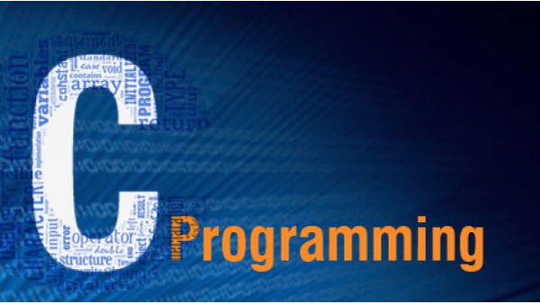
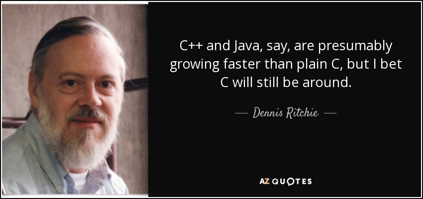

 
# PERFEX_C
## C -Projects:fire:
- **In this repository there are  random C-projects basics to advanced which are done by me if you like it start them and fork this repo:smile:**
***
## Logic-building:heart:
- what is  main motive of this? 
- [x] To build good logic in programing and write good code
- [x] Art of writing good code  
- [x] Making plan of what we are going to to do in code 
- [x] step by step thinking for logic
***

